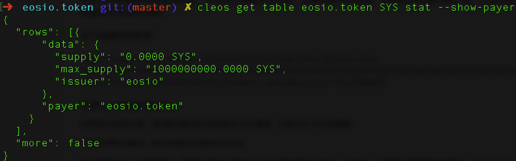
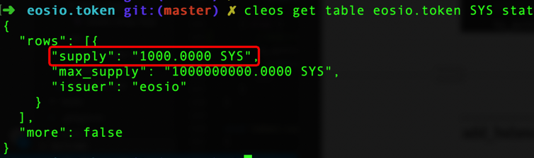
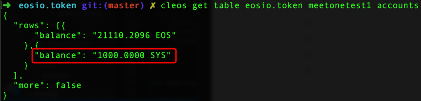
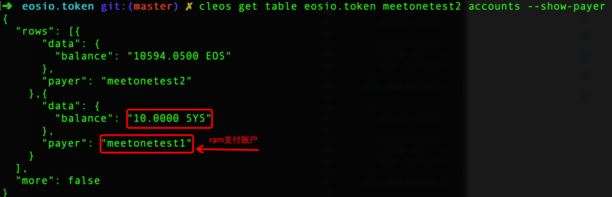
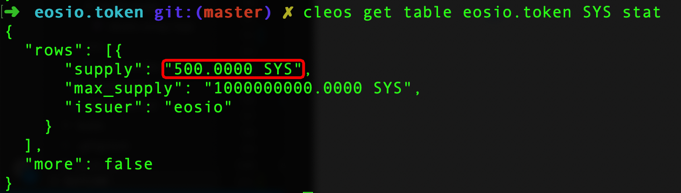
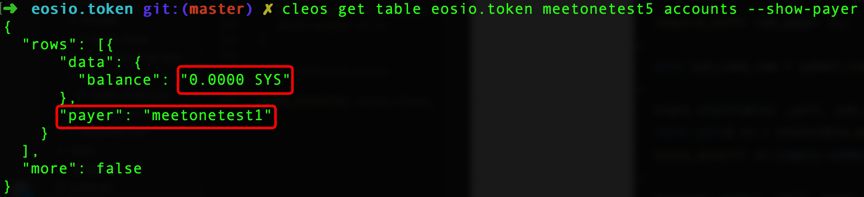
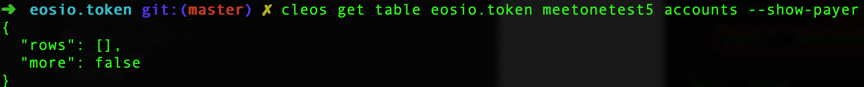

# eosio.token合约分析

## 合约说明

eosio.token合约可用于创建多种不同的代币，任何部署该合约的账户都可以创建和发放代币。但是也并非随意可以部署，毕竟在主网上部署合约需要消耗RAM、CPU和NET资源。以1.5.x版本的[eosio.token](https://github.com/EOSIO/eosio.contracts/tree/release/1.5.x)合约，1.4.1版本的[eosio.cdt](https://github.com/EOSIO/eosio.cdt/tree/release/1.4.x)编译器为例：通过编译器生成的eosio.token.wasm文件大小是`22604 byte`，eosio.token.abi文件大小是`4476 byte`，部署到主网需要消耗的RAM是：

```
.wasm*10 + .abi
```

也就是`230516 byte`。按`1KB = 0.0618 EOS`，需要支付`14`个EOS，同时CPU需要消耗`16ms`左右。

## 创建合约账户

部署eosio.token合约之前需要创建用于部署合约的账户：
```
cleos create account eosio eosio.token <owener-key> <active-key>
```

## 编译、部署合约

编译eosio.token合约：
```
eosio-cpp -contract=eosio.token -abigen eosio.token.cpp -o eosio.token.wasm
```
编译完成后会同时生成`eosio.token.wasm`和`eosio.token.abi`文件
部署eosio.token合约：
```
cleos set contract eosio.token ../eosio.token 
```
检验是否部署成功：
```
cleos get code eosio.token 
```


hash值存在说明已成功部署。

## 创建token (create)

```
cleos push action eosio.token create ‘[“eosio”,”100000000.0000 SYS”]’ -p eosio.token 
```

### 源码分析
```
void token::create( name   issuer,
                    asset  maximum_supply )
{  
   //这里 _self 是部署合约的账户eosio.token，
   //命令行最后需要加上 -p eosio.token 否则无权限执行  
    require_auth( _self );

    auto sym = maximum_supply.symbol; //获取代币符号

    //检查token符号和token数量是否合法
    eosio_assert( sym.is_valid(), "invalid symbol name" );
    eosio_assert( maximum_supply.is_valid(), "invalid supply");
    eosio_assert( maximum_supply.amount > 0, "max-supply must be positive");

   //stat表的实例化，由合约创建的用于存储token数据的table, sym.code().raw()查表时的scope，token符号转uint64_t表示
    stats statstable( _self, sym.code().raw() );
    auto existing = statstable.find( sym.code().raw() );
    //检查该账户之前是否创建过这个token
    eosio_assert( existing == statstable.end(), "token with symbol already exists" );
   //stat表添加记录
    statstable.emplace( _self, [&]( auto& s ) {
       s.supply.symbol = maximum_supply.symbol;
       s.max_supply    = maximum_supply;
       s.issuer        = issuer;
    });
}
```
stats是在token.hpp中已经定义的multi_index表，其结构如下：
```
struct [[eosio::table]] currency_stats {
asset    supply;
    asset    max_supply;
    name     issuer;

    uint64_t primary_key()const { return supply.symbol.code().raw(); }
};
```
实例化后表名为“stat”
```
typedef eosio::multi_index< "stat"_n, currency_stats > stats;
```
执行完上述create action后eosio.token合约会创建一张stat表，以下是查询stat表数据的命令：



**命令行:**
-`cleos get table`: 获取table的系统命令
-`eosio.token`: table 的所有者账户名
-`SYS`: tonken符号(源码中提到的查表时的scope)
-`stat`: 表名，实例化时候声明
-`--show-payer`: 显示为创建stat表支付RAM的账户

**表结构:**
-`supply`: 目前可流通的token数量
-`max_supply`: 最大可流通的token数量
-`issuer`: 空投或者发币的账户
-`payer`: 支付RAM的账户
-`more`: 是否还有未显示数据

上述过程创建了可以发行的token，但是在市面上还不能流通，因为supply里面是0，这时候需要issue来空投或发币可以流通的数量。

## 空投或发币(issue)

```
cleos push action eosio.token issue ‘[“meetonetest1”,”1000.0000 SYS”，”airdrop”]’ -p eosio 
```
空投时需要eosio.token合约中的issue action，第一个参数是空投到的账户名，第二个是空投的数量，第三个参数是留言信息，action的权限必须提供是create时候的issuer账户的权限。

### 源码分析

```
void token::issue( name to, asset quantity, string memo )
{
   //token字符有效性检查，字符串大小检查
    auto sym = quantity.symbol;
    eosio_assert( sym.is_valid(), "invalid symbol name" );
    eosio_assert( memo.size() <= 256, "memo has more than 256 bytes" );
   
   //合约是否已经创建过token检验
    stats statstable( _self, sym.code().raw() );
    auto existing = statstable.find( sym.code().raw() );
    eosio_assert( existing != statstable.end(), "token with symbol does not exist, create token before issue" );
    const auto& st = *existing;
   //-p 必须是issuer账户权限
    require_auth( st.issuer );
    eosio_assert( quantity.is_valid(), "invalid quantity" );
    eosio_assert( quantity.amount > 0, "must issue positive quantity" );

    eosio_assert( quantity.symbol == st.supply.symbol, "symbol precision mismatch" );
    eosio_assert( quantity.amount <= st.max_supply.amount - st.supply.amount, "quantity exceeds available supply");
   //修改supply值，supply值为目前可以流通量
    statstable.modify( st, same_payer, [&]( auto& s ) {
       s.supply += quantity;
    });
   //修改issuer账户下balance的值
    add_balance( st.issuer, quantity, st.issuer );
   //这是个内敛action如果to不是issuer，则issuer会调用该合约的action方法给to账户转账
    if( to != st.issuer ) {
      SEND_INLINE_ACTION( *this, transfer, { {st.issuer, "active"_n} },
                          { st.issuer, to, quantity, memo }
      );
    }
}
```
issue每发行一次会增加市面上可流通的token总数。不过空投也是不小的开销，不管是首次空投给新账户还是给自身，`add_balance`的时候都会创建一张`accunts`表，`add_balance`是内部函数，三个参数分别时`owner`（token发行账户）、`quantity`（空投金额）和`ram_payer`（ram支付账号），创建这张表会消耗`240byte`的ram，空投的用户量很大的话，这将会是一笔很大的ram消耗。但是当用户相互使用push action transfer来转账时会有`128byte`的ram会返回给空投的账户，这`128byte`的ram会由转帐的用户来支付，而`112byte`则是空投账户的固定消耗，只有当用户close这个token时才会被完全释放，close会在下文中提到。
```
void token::add_balance( name owner, asset value, name ram_payer )
{
   //实例化accounts表，由合约创建，scope为onwer账户
   accounts to_acnts( _self, owner.value );
   auto to = to_acnts.find( value.symbol.code().raw() );
   if( to == to_acnts.end() ) {
      //首次需要emplace创建表格
      to_acnts.emplace( ram_payer, [&]( auto& a ){
        a.balance = value;
      });
   } else {
      //非首次创建会在原balance基础上加上此次的值
      to_acnts.modify( to, same_payer, [&]( auto& a ) {
        a.balance += value;
      });
   }
}
```
`add_balance`在`issue`、`transfer`是会被调用，用于调整相关token账户的余额。
上文通过命令行空投给`meetonetest1`后，通过查询supply增加`1000.0000 SYS`



查询`meetonetest1`的`accounts`表可以看到`balance`多了条记录，由eosio空投给`meetonetest1` `1000.0000 SYS`，这样市面上就有`1000.0000 SYS` 可以流通了。



## 转账(transfer)

命令行提供了两种转账方式：
**方式一：**
```
cleos push action eosio.token transfer '["meetonetest1","meetonetest2","10.0000 SYS","for transfer"]' -p meetonetest1 
```
**方式二：**
```
cleos transfer meetonetest1 meetonetest2 '10.0000 SYS' 'for transfer'
```
每个账户之间的相互转账都得用到transfer。

### 源码分析

```
void token::transfer( name    from,
                      name    to,
                      asset   quantity,
                      string  memo )
{
    //不能转账给自己
    eosio_assert( from != to, "cannot transfer to self" );
    //需要校验转出账户的权限
    require_auth( from );
    //检验转入账户是否存在
    eosio_assert( is_account( to ), "to account does not exist");
    //转账token的表
    auto sym = quantity.symbol.code();
    stats statstable( _self, sym.raw() );
    const auto& st = statstable.get( sym.raw() );
    //通知from和to账户
    require_recipient( from );
    require_recipient( to );
    //转账金额相关检验
    eosio_assert( quantity.is_valid(), "invalid quantity" );
    eosio_assert( quantity.amount > 0, "must transfer positive quantity" );
    eosio_assert( quantity.symbol == st.supply.symbol, "symbol precision mismatch" );
    eosio_assert( memo.size() <= 256, "memo has more than 256 bytes" );
    //accounts表ram的费用的支付
    auto payer = has_auth( to ) ? to : from;
    //转出账户减去相应金额
    sub_balance( from, quantity );
    //转入账户加上相应金额
    add_balance( to, quantity, payer );
}
```
`transfer` action内调用了`sub_balance` 和 `add_balance`，`sub_balance`传入的参数是`from`（转出的账户名）和`quantity`（转出的金额），用于调整转出账户的余额。`add_balance`上文已经提到过，这里用户调整转入账户的余额。
```
void token::sub_balance( name owner, asset value ) {
   accounts from_acnts( _self, owner.value );
   //转出账户的accounts表
   const auto& from = from_acnts.get( value.symbol.code().raw(), "no balance object found" );
   //转出金额是否超过余额
   eosio_assert( from.balance.amount >= value.amount, "overdrawn balance" );
   //accounts表中的balance值减去转出金额
   from_acnts.modify( from, owner, [&]( auto& a ) {
         a.balance -= value;
      });
}
```
如前文所述转账提供了两种方式，虽然都实现转账功能，但是有一点不同的是不管转入账户是不是第一次被空投该token第一种方式转账的时候需要消耗的是转出账户的ram，若转入账户不是第一次空投该token则第二种方式不会消耗转出账户的ram。



## 缩减可流通量(retire)

既然有增加流通量的`issue` action，自然也有缩减流通量的action，eosio.token提供了`retire`的action用于缩减当前流通量。缩减的前提是token的issuer账户必须有余量。由于上文中的例子可流通的量都空投给了meetonetest1账户，因此无法缩减可流通量，需回收后才可以缩减。
```
cleos push action eosio.token retire '["500.0000 SYS","for retire"]' -p token@active
```
这是从meetonetest1回收回来的`500.0000 SYS`用于缩减可流通量。

### 源码分析

```
void token::retire( asset quantity, string memo )
{
    //常规检验，和issue相同
    auto sym = quantity.symbol;
    eosio_assert( sym.is_valid(), "invalid symbol name" );
    eosio_assert( memo.size() <= 256, "memo has more than 256 bytes" );

    stats statstable( _self, sym.code().raw() );
    auto existing = statstable.find( sym.code().raw() );
    eosio_assert( existing != statstable.end(), "token with symbol does not exist" );
    const auto& st = *existing;

    require_auth( st.issuer );
    eosio_assert( quantity.is_valid(), "invalid quantity" );
    eosio_assert( quantity.amount > 0, "must retire positive quantity" );

    eosio_assert( quantity.symbol == st.supply.symbol, "symbol precision mismatch" );
    //减少supply量，也即市面上可流通都总量
    statstable.modify( st, same_payer, [&]( auto& s ) {
       s.supply -= quantity;
    });
    //修改token发行者issuer的balance余量
    sub_balance( st.issuer, quantity );
}
```
和issue流程类似相同，只是在最后时对stat表中的操作，`retire`是用的`sub_balance`，而`issue`是`add_balance`。
执行完上述`retire`命令后:



可以看到`retire`后，可流通的量减少了。

## 添加token余额表(open)

eosio.token提供了首次在accounts表中添加相关token的余额balance数据（目前还没发掘在哪里需要用到）的action `open`。
```
cleos push action eosio.token open '["meetonetest5","4,SYS","meetonetest1"]' -p meetonetest1
```

### 源码分析

```
void token::open( name owner, const symbol& symbol, name ram_payer )
{
   require_auth( ram_payer );

   auto sym_code_raw = symbol.code().raw();

   stats statstable( _self, sym_code_raw );
   const auto& st = statstable.get( sym_code_raw, "symbol does not exist" );
   eosio_assert( st.supply.symbol == symbol, "symbol precision mismatch" );

   accounts acnts( _self, owner.value );
   auto it = acnts.find( sym_code_raw );
   if( it == acnts.end() ) {
      //无该token时，加入该token的balance
      acnts.emplace( ram_payer, [&]( auto& a ){
        //balance的值设置为0
        a.balance = asset{0, symbol};
      });
   }
}
```
-`owner`：需要在accounts表添加balance记录的账户
-`symbol`：token的符号，包括精度
-`ram_payer`：为添加记录消耗ram的账户
执行上述命令行后结果：



上述命令行执行后meetonetest1会为meetonetest5的accounts添加一条token为SYS的balance记录，而meetonetest1会为添加这条数据支付相应的ram费用。

## 删除token余额表（close）

当accounts表中token的balance值为0时，可以使用`close` action删除该条记录，释放相应的ram。
```
cleos push action eosio.token close '["meetonetest5","4,SYS"]' -p meetonetest5
```

### 源码分析

```
void token::close( name owner, const symbol& symbol )
{  
   //需要对应账户的权限
   require_auth( owner );

   accounts acnts( _self, owner.value );
//查找symbol记录
   auto it = acnts.find( symbol.code().raw() );
   eosio_assert( it != acnts.end(), "Balance row already deleted or never existed. Action won't have any effect." );
   //只有balance值为0时才能关闭
   eosio_assert( it->balance.amount == 0, "Cannot close because the balance is not zero." );
   //这是删记录的操作，会删除该条balance记录
   acnts.erase( it );
}
```
-`owner`: 需要删除的账户名
-`symbol`: 需要删除的token
执行完上述命令后：



这命令将meetonetest5的accounts表中token为SYS的记录删除，当然前提条件是balance值必须为0，相应的为该条balance这条记录消耗ram的账户meetonetest1也收回当时支付的ram。
